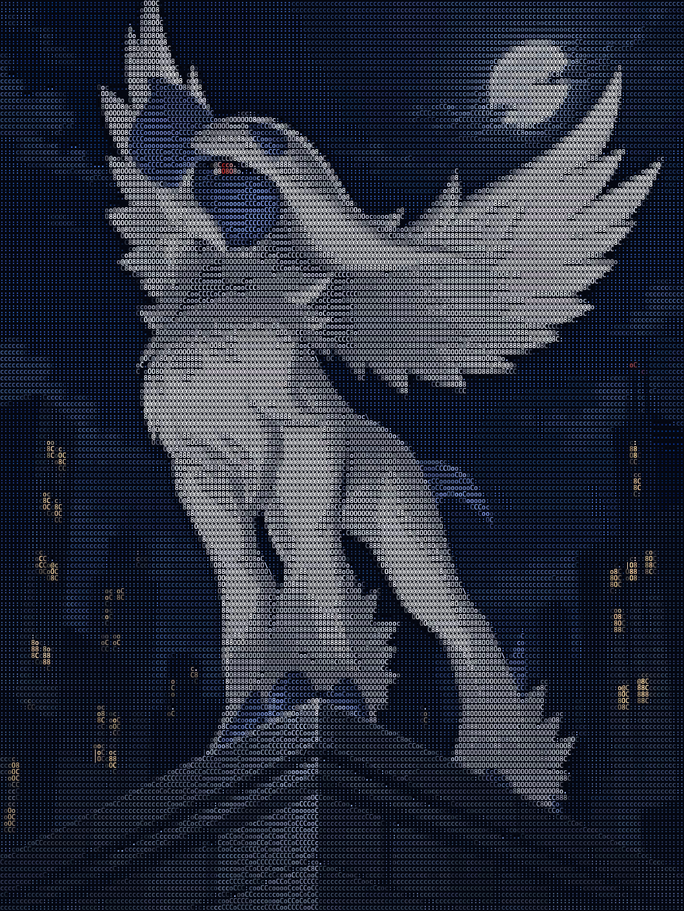
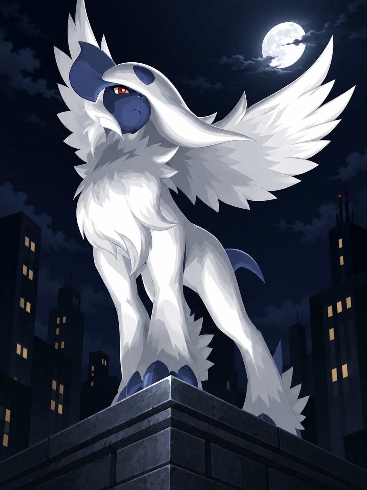

# Charfall

Convert images to colored ASCII in your terminal, or export HTML, TXT, JSON,
ANSI, SVG, and PNG. Reads BMP, GIF, JPEG, PNG, TIFF, and WebP; animated images
use the first frame.

## Example

PNG export at 176 columns with the default rendering settings:



<details>
<summary>Source image and reproduction command</summary>



After building Charfall:

```sh
./bin/charfall examples/rooftop-absol.png --columns 176 --formats png -o examples/rooftop-absol-ascii.png --overwrite
```

</details>

## Getting started

Requires Go 1.27 or newer. From the repository root:

```sh
go build -o bin/charfall ./cmd/charfall
./bin/charfall examples/rooftop-absol.png
```

The ASCII prints in your terminal without creating files. Run
`./bin/charfall --help` for all options.

## Output

Terminal output is sized to the window. Set `--columns` for a fixed width:

```sh
./bin/charfall photo.png --columns 120
```

Redirecting or piping stdout produces plain text without color codes:

```sh
./bin/charfall photo.png --columns 80 > ascii.txt
```

Save files with `--formats`, or use `--extra-exports` for all six formats:

```sh
./bin/charfall photo.png --formats png -o ascii.png
./bin/charfall photo.png --formats html,txt -o output
./bin/charfall photo.png --extra-exports -o output
```

Exports and redirected text default to 176 columns. For one format, `-o` is a
filename; for multiple formats, it is a directory. Without `-o`, the names are
`photo-ascii.<format>` or `photo-ascii/`. Open `index.html` to view an HTML
directory export. Other files in that directory are named `ascii.<format>`.

`--formats` and `--extra-exports` are mutually exclusive. `-o` and
`--overwrite` require one of them. Existing files require `--overwrite`;
directory exports also remove obsolete generated formats while keeping
unrelated files. Errors and export status go to stderr.

## Adjusting the ASCII

```sh
./bin/charfall photo.png --style bright --quality shape
```

- `--quality`: `tone` matches brightness, `shape` matches glyph shapes, and
  `neighborhood` (default) also refines neighboring cells.
- `--style`: `classic` (default), `bright`, `hybrid`, or `full-color`.
- `--background`: transparency and ASCII background; default `#040711`.
- `--brightness` and `--contrast`: manual adjustments that disable auto-tone.
- `--auto-tone=false`: disable automatic tone adjustment.

## Fonts

Menlo measurements are bundled. PNG uses the bundled raster; HTML and SVG
try Menlo, then Consolas, then the viewer's monospace font. Terminal output
uses your terminal's font.

Use a monospace TTF or OTF to measure another font. HTML and SVG embed it;
PNG uses its raster. This does not change your terminal's font.

```sh
./bin/charfall photo.png --font path/to/font.ttf --formats png -o ascii.png
```

`--font-size` defaults to 10 and accepts 6–32. Font files must be at most
32 MiB and contain every supported glyph. To reuse measurements:

```sh
./bin/charfall calibrate path/to/font.ttf -o font-profile.json
./bin/charfall photo.png --glyph-profile font-profile.json
```

Use either `--font` or `--glyph-profile`. Calibration uses `--size` for font
size, writes JSON to stdout without `-o`, and never overwrites a profile.
If you set `--cell-aspect`, shape-based rendering requires it to match the
profile's measured spacing.

## Limitations

Automatic sizing reads the window dimensions once per run. Taller images can
be constrained by terminal height; a larger window or smaller font allows
more detail. A fixed `--columns` can cause wrapping or scrolling, and extremely
tall images can scroll even with automatic sizing. Resizing requires rerunning
the command.

Colors require 24-bit ANSI support; use `NO_COLOR=1` or `TERM=dumb` for plain
text. Font spacing and antialiasing can differ between terminals, browsers,
and the measured raster. SVG viewers must support embedded fonts when used.

Requests exceeding these memory limits return an error:

| Resource | Limit |
| --- | --- |
| Decoded input | 89,478,485 pixels |
| Output grid | 1,000,000 character cells |
| Shape sampling | 8,000,000 subcells |
| PNG export | 40,000,000 pixels |

Shape sampling applies to `shape`, `neighborhood`, and `full-color`. Each
cell uses `mask width × mask height` subcells: the bundled 6 × 10 masks allow
133,333 cells. Reduce `--columns`, or use `--quality tone` with `classic` or
`bright` to avoid shape sampling. Oversized input images must be resized.

Terminal detection and file exports support macOS, Linux, FreeBSD, OpenBSD,
NetBSD, and DragonFly BSD. Other platforms print plain text; Windows file
exports are unsupported. Calibration works independently of export locking.
Only macOS has been tested at runtime.

Single-file replacements are atomic; a directory's files are not replaced
as one atomic set. Interrupted directory exports recover on the next export;
failed recovery retains files for inspection. Interrupted single-file exports
can leave a temporary file beside the destination.

## Development

```sh
go test -count=1 ./...
go test -race -count=1 ./...
go vet ./...
go build -o bin/charfall ./cmd/charfall
```

Source and tests live in `cmd/charfall/`; embedded font measurements live in
`cmd/charfall/profiles/`.
